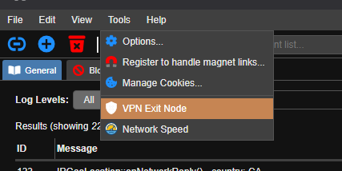
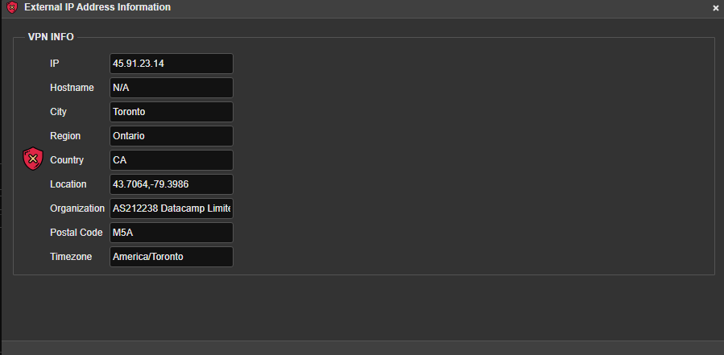
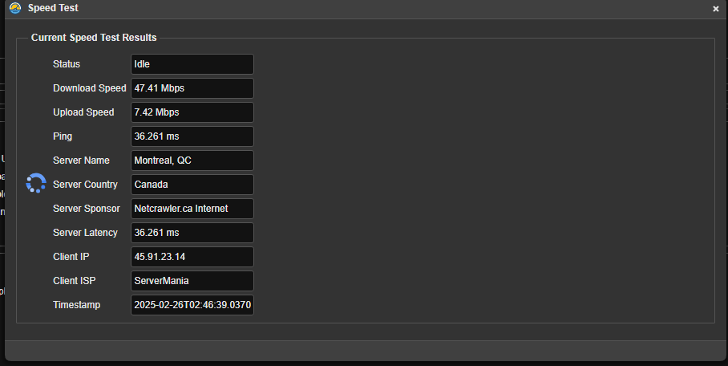
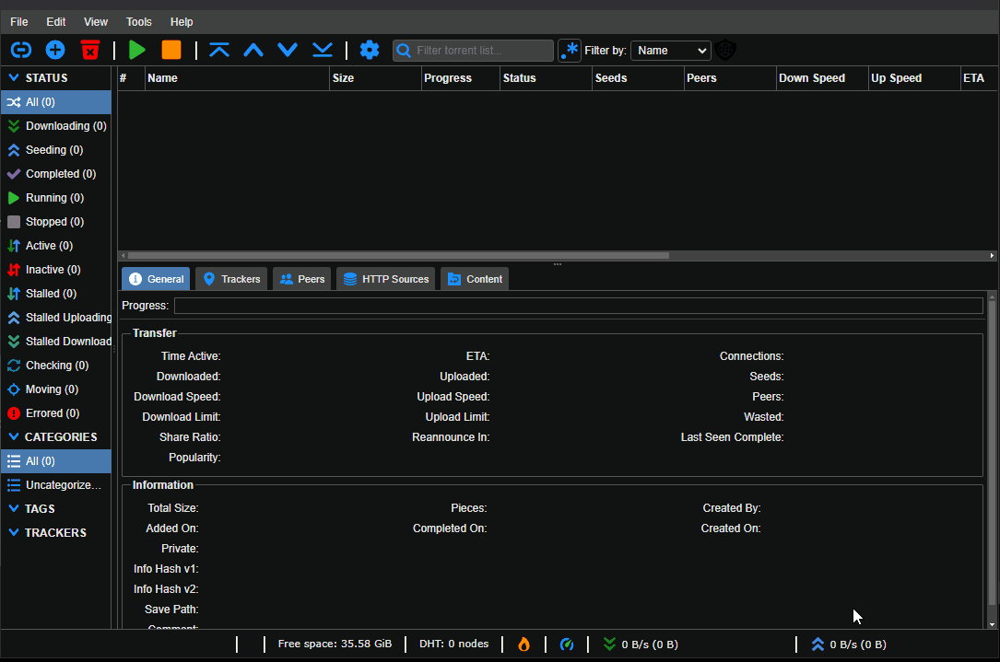

<center></center>
<center></center>

## Description

**qBittorrent** is Qt-based bittorrent client. **Branch Of** [qbittorrent/qBittorrent](https://github.com/qbittorrent/qBittorrent). My branch is aimed at having a stable codebase for my **headless qBittorrent version** used for my docker container](https://github.com/arsscriptum/docker.qBittorrentNoxVpn) which runs this latest headless qBittorrent client while connecting to OpenVPN with integrated VPN.

It can be used in standalone mode, but it's not supported.

## Qt Dependency 

### Install Qt6 using the official Qt installer (if you don't have Qt6)

1. Download the Qt installer:
   ```sh
   wget https://download.qt.io/official_releases/online_installers/qt-unified-linux-x64-online.run
   ```
2. Make it executable:
   ```sh
   chmod +x qt-unified-linux-x64-online.run
   ```
3. Run the installer:
   ```sh
   ./qt-unified-linux-x64-online.run
   ```
4. Follow the GUI installation steps to install Qt6.

5. Set the correct Qt6 environment variables:
   ```sh
   export Qt6_DIR=~/Qt/6.x.x/gcc_64/lib/cmake/Qt6
   export PATH=~/Qt/6.x.x/gcc_64/bin:$PATH
   ```

### Other Dependencies

1. Boost >= 1.76
2. libtorrent-rasterbar 1.2.19 - 1.2.x || 2.0.10 - 2.0.x
3. OpenSSL >= 3.0.2
4. zlib >= 1.2.11
5. CMake >= 3.16
6. Python >= 3.9.0. Optional, run-time only. Used by the bundled search engine


## Build 

Make sure you have [Qt6 Installed](https://doc.qt.io/qt-6/get-and-install-qt.html) and export those paths:

```bash
export Qt6_DIR=/path/to/Qt/6.8.2/gcc_64/lib/cmake/Qt6
export PATH=/path/to/Qt/6.8.2/gcc_64/bin:$PATH
```

### Compile and install qBittorrent with Qt graphical interface

```bash
  $ cmake -B build -DCMAKE_BUILD_TYPE=Release
  $ cmake --build build
  $ cmake --install build
  $ qbittorrent
```
  will install and execute qBittorrent.

### Compile and install qBittorrent without Qt graphical interface

```bash
  $ cmake -B build -DCMAKE_BUILD_TYPE=Release -DGUI=OFF
  $ cmake --build build
  $ cmake --install build
  $ qbittorrent-nox
```

### Build using script

There's a [script](./scripts/build.sh) I use to build. If you want a GUI application, use the ```--gui``` option. Else, it defaults to headless version (WEBUI).


```bash
Usage: ./scripts/build.sh [options]
  -t, --target <Debug|Release>    Build target
  -c, --clean                     Clean
  -g, --gui                       Enable GUI
  -n, --nomake                    No make, just configure
  -h, --help                      Show this help message
  -r, --release                   Release Build, headless
  -d, --debug                     Debug Build, headless
```

#### Build with Script - Headless

```bash
./scripts/build.sh --release
```

#### Build with Script - Gui

```bash
./scripts/build.sh --gui -t Debug
```


#### Version generation

I wrote a script that updates the version build number everytime I build (helps identify what Im testing). To avoid version files generation to mess your commits:

```bash
git update-index --assume-unchanged version.nfo
git update-index --assume-unchanged build.nfo
```

## Installation

I wrote an [install script](./scripts/install.sh) that will copy all dependencies to a install directory of your choice. It uses [ctdeployer](https://github.com/QuasarApp/CQtDeployer).

If you don't have [ctdeployer](https://github.com/QuasarApp/CQtDeployer), you can quickly install it using the script by doing:

```bash
sudo ./scripts/install.sh --install-ctdeploy
``` 

This will get the package, verify the checksum and insatll it.

Then install using

```bash
sudo ./scripts/install.sh
``` 

The install path is in **install**


## Features

| **FEATURES**                            |  **STATUS** | **VERSION** | **DOCKERHUB** |
|-----------------------------------------|:-----------:|:----------:|:-------------:|
| ➭ Display External Ip Address Info      |   ✔️ done   |     1.2     |    [1.2.0](https://hub.docker.com/repository/docker/arsscriptum/qbittorrentvpn/tags/1.2/sha256-eb4e39680cf805d838f765a137169f51463704ccab2dc66cfd700b1eb60178cd) |
| ➭ Read DHT bootstrap nodes from cfg     |   ✔️ done   |     1.2     |      same     |
| ➭ Integrate speedtest-cli in build      |   ✔️ done   |     1.2     |      same     |
| ➭ Add a menu to show speed test results |   ✔️ done   |     1.2     |     same      |
| ➭ Add WebAPI functions for network data |   ✔️ done   |     1.2     |     same      |
| ➭ Add WebAPI functions to get version   |   🚧 wip    |      ♒︎    |       ❌       |
| ➭ Show REAL version in UI               |   🚧 wip    |      ♒︎    |       ❌       |

## Versions

| **VERSION** |   **STATUS**   | **DOCKERHUB** |    **DATE**  |
|-------------|:--------------:|:-------------:|:------------:|
|  **1.2.0**  |    ✔️ Stable    |     1.2.0    |  20/02/2025  |
|  **1.4.0**  | ■■■■■■■□□□□ 60% |       ❌      |      ❌     |
|  **1.5.0**  |        ⏳       |       ♒︎     |      ♒︎     |
|  **1.6.0**  |        ⏳       |       ♒︎     |      ♒︎     |


## Added Functionalities

1. View the External IP address information from [ipinfo.io](ipinfo.io/json) so I can confirm that Im on a VPN
2. Speed Check on my VPN connection, using [OOKLA's speedtest-cli](https://www.speedtest.net/apps/cli) . Linux Package [ookla-speedtest-1.2.0-linux-x86_64.tgz](https://install.speedtest.net/app/cli/ookla-speedtest-1.2.0-linux-x86_64.tgz)



### Get External IP Address



### Speed Test



## Test

