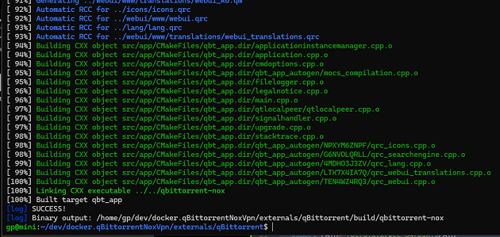

# qBittorrent - A BitTorrent client in Qt

## Description:
qBittorrent is a bittorrent client programmed in C++ / Qt that uses
libtorrent (sometimes called libtorrent-rasterbar) by Arvid Norberg.

It aims to be a good alternative to all other bittorrent clients
out there. qBittorrent is fast, stable and provides unicode
support as well as many features.


## Qt Dependency 

### Install Qt6 using the official Qt installer (if you don't have Qt6)

1. Download the Qt installer:
   ```sh
   wget https://download.qt.io/official_releases/online_installers/qt-unified-linux-x64-online.run
   ```
2. Make it executable:
   ```sh
   chmod +x qt-unified-linux-x64-online.run
   ```
3. Run the installer:
   ```sh
   ./qt-unified-linux-x64-online.run
   ```
4. Follow the GUI installation steps to install Qt6.

5. Set the correct Qt6 environment variables:
   ```sh
   export Qt6_DIR=~/Qt/6.x.x/gcc_64/lib/cmake/Qt6
   export PATH=~/Qt/6.x.x/gcc_64/bin:$PATH
   ```

## Build 

Make sure you have [Qt6 Installed](https://doc.qt.io/qt-6/get-and-install-qt.html) and export those paths:

```bash
export Qt6_DIR=/path/to/Qt/6.8.2/gcc_64/lib/cmake/Qt6
export PATH=/path/to/Qt/6.8.2/gcc_64/bin:$PATH
```


### Build using script

```
./scripts/build.sh
```



#### Version generation

Avoid version files generation to mess your commits:

```bash
git update-index --assume-unchanged version.nfo
git update-index --assume-unchanged build.nfo
```

### Installation:

Refer to the [INSTALL](INSTALL) file.
